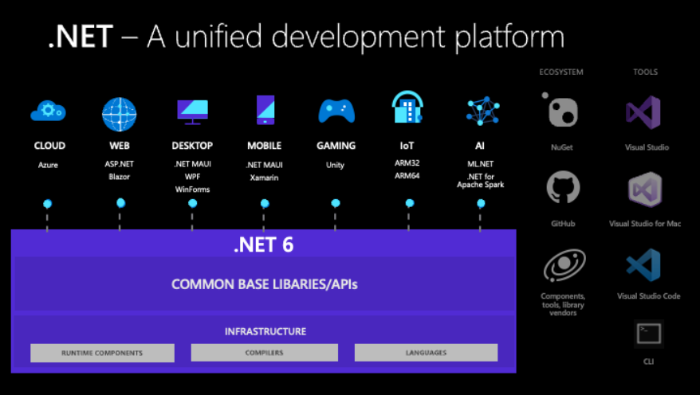

# LEASSONS (.NET 6.0)

## TECHNOLOGIES:

## USEFUL LINKS:
| Description | Link |
| ------ | ------ |
| .NET Docs | https://docs.microsoft.com/dotnet/ |
| .NET Tutorials | https://learn.microsoft.com/en-us/dotnet/core/tutorials/ |
| .NET Hello world tutorial | https://aka.ms/dotnethelloworld |

 

## ENVIRONMENT:
| Description | Link |
| ------ | ------ |
| CLI | https://learn.microsoft.com/pt-br/dotnet/core/tools/ |
| .NET 6 | https://dotnet.microsoft.com/en-us/download |
| VSCode | https://code.visualstudio.com/download |
| VSCode2 | https://code.visualstudio.com/docs/setup/setup-overview |
| C# Extension | https://marketplace.visualstudio.com/items?itemName=ms-dotnettools.csharp |